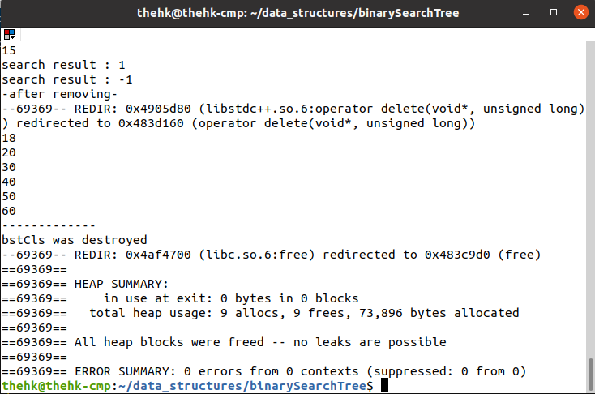

# Binary Search Tree

Binary Search Tree is anotherdata structure type. It helps to store sorted data. Those kind of sorting process can be possible in also linked list. However, binary search tree makes easy to reach a wanted element of the tree.
definition of the binary tree was shown in the below.

                            main node
                            /       \
                           /         \
                    left node     right node
(left node) < (main node)
(right node) > (main node)

## Valgrind Results

#### Hamza Karakus