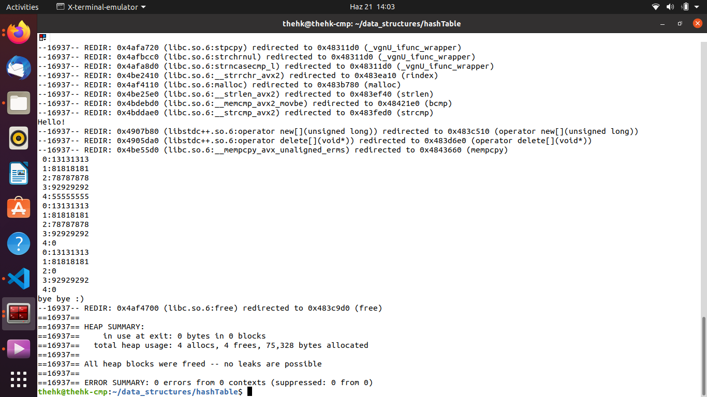

# Hash Table
Hash table is a one of the data structure which provides easy access to the data. Mainly, Hash table focuses to the key value which will gives the parameter to the hash function. After all, hash function will generate a index for the array. The value which is required can be found that index if it is not-overwritten. If there is another data was placed to the same index it can be controlled by comparing key values. if key values are differnet from each other itwill linearly search the correct key to reach the required value.

## Valgrind Results

#### Hamza Karakus