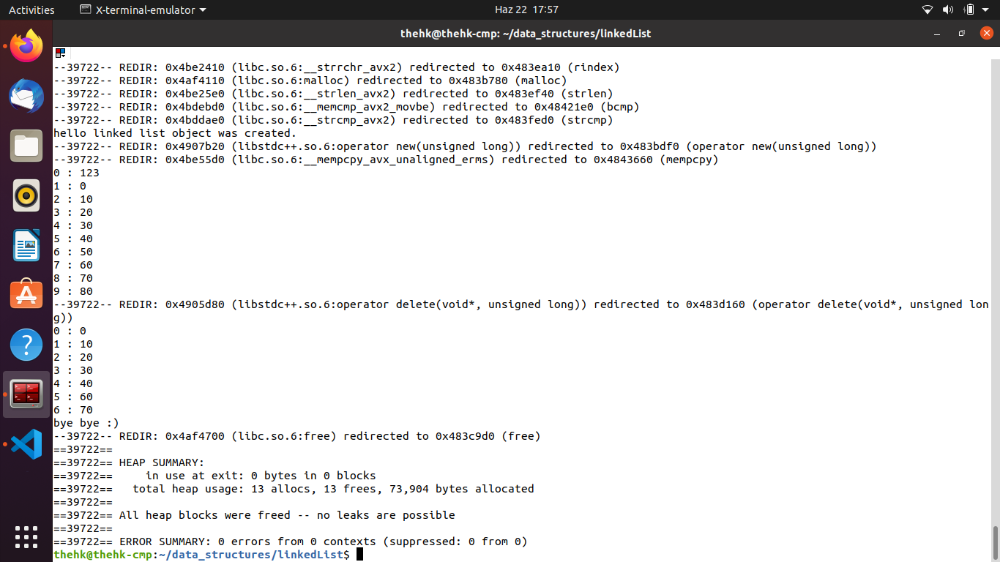

# Linked List
linked list is a data structure that one element pointing another element. There are some sort of linked list such as circular linked list, normal linked list. 
## Valgrind Results

#### Hamza Karakus
